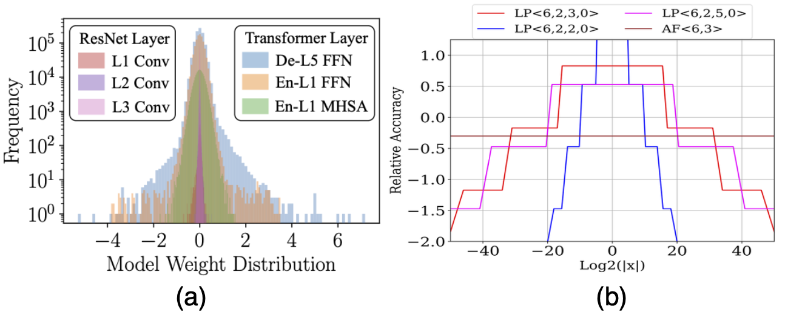

# Algorithm-Hardware Co-Design of Distribution-Aware Logarithmic-Posit Encodings for Efficient DNN Inference

<div align="center">
  
</div>

`(a) Weight distributions of ResNet50 and ViT (De: Decoder, En: Encoder) layers, (b) LP’s relative-accuracy plot, showing distribution-aware properties compared to AdaptivFloat.`

**Abstract**:

Traditional Deep Neural Network (DNN) quantization methods using integer, fixed-point, or floating-point data types struggle to capture diverse DNN parameter distributions at low precision, and often require large silicon overhead and intensive quantization- aware training. In this study, we introduce Logarithmic Posits (LP), an adaptive, hardware-friendly data type inspired by posits that dynamically adapts to DNN weight/activation distributions by parameterizing LP bit fields. We also develop a novel genetic- algorithm based framework, LP Quantization (LPQ), to find optimal layer-wise LP parameters while reducing representational diver- gence between quantized and full-precision models through a novel global-local contrastive objective. Additionally, we design a unified mixed-precision LP accelerator (LPA) architecture comprising of processing elements (PEs) incorporating LP in the computational datapath. Our algorithm-hardware co-design demonstrates on aver- age <1% drop in top-1 accuracy across various CNN and ViT models. It also achieves ∼ 2× improvements in performance per unit area and 2.2× gains in energy efficiency compared to state-of-the-art quantization accelerators using different data types.

This repository contains the official source code of the Logarithmic Posits (LP) class used in the paper `Algorithm-Hardware Co-Design of Distribution-Aware Logarithmic-Posit Encodings for Efficient DNN Inference` (Acceped at DAC 2024). 

Our implementation of Logarithmic Posits is inspired from [here](https://github.com/mightymercado/pysigmoid/tree/master). Please follow the instructions in [PySigmoid](https://github.com/mightymercado/pysigmoid/tree/master) for environment setup instructions.

Logarithmic Posits is an adaptive, hardware-friendly data type inspired by posits that dynamically adapts to DNN weight/activation distributions by parameterizing the following bit-fields (Exponent size, scale factor and regime).

The base algorithm can be found at `LogPos/LogarithmicPosit.py`.


# Usage

The provided class can be easily plugged in with any quantization framework for simulated quantization experimentation.

```python
import torch
import numpy
from LogarithmicPosit import *


for parameter in self.model.named_parameters():
    params_np = parameter.cpu().data.numpy()
    # Quantize
    params_quant = LogarithmicPosit(params_np, nbits=8, es=2, rs=2, sf=0)
    # Dequantize
    params_dequant = torch.from_numpy(params_quant).float().cuda()
```

## Citation
If you use our work in your research, please cite our paper:
```bibtex
@misc{ramachandran2024algorithmhardware,
      title={Algorithm-Hardware Co-Design of Distribution-Aware Logarithmic-Posit Encodings for Efficient DNN Inference}, 
      author={Akshat Ramachandran and Zishen Wan and Geonhwa Jeong and John Gustafson and Tushar Krishna},
      year={2024},
      eprint={2403.05465},
      archivePrefix={arXiv},
      primaryClass={cs.AR}
}
```